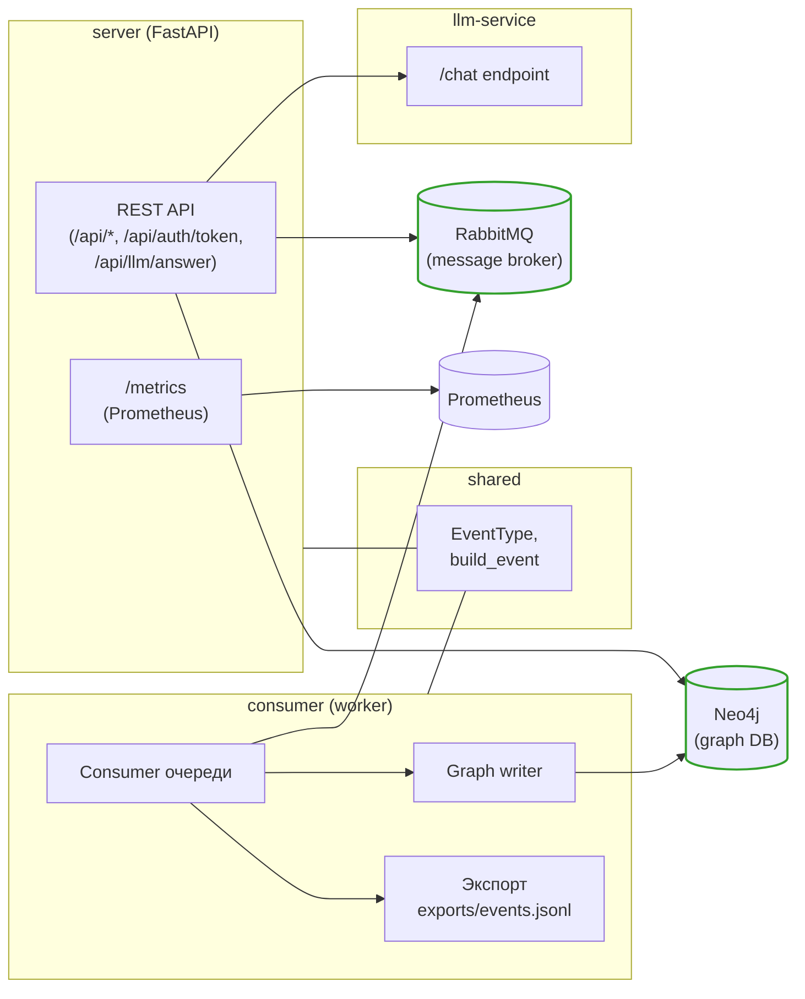

## Архитектура WinM (UML-диаграмма для GitHub)

Ниже — диаграмма в формате Mermaid, который GitHub умеет рендерить напрямую. Показаны только основные сервисы и их связи.

Описание:

- **Server**: читает из Neo4j, публикует события в RabbitMQ, отдаёт REST API и метрики для Prometheus, проксирует запросы к `llm-service`.
- **Consumer**: подписывается на очередь RabbitMQ, пишет изменения в Neo4j и экспортирует события в `exports/events.jsonl`.
- **Shared**: общие типы событий (`EventType`) и фабрика `build_event`, которые используют и server, и consumer.
- **llm-service**: отдельный сервис, который обрабатывает запросы от server по HTTP.

